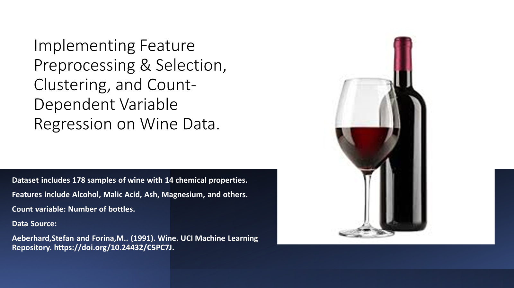

# Wine Data Analysis Project

## Table of Content
- Project Overview
- Data Description
- Feature Preprocessing and Selection
- Dimensionality Reduction (PCA)
- Clustering Algorithms 
- Regression
- Resources

## Project Overview
This project aims to analyze a dataset of wine samples to identify patterns and predict wine preferences based on the number of bottles, considering their physicochemical properties. 

## Dataset Description
The dataset contains 178 wine samples, each characterized by 13 features such as alcohol content, malic acid, ash, etc.

## Analyses Performed

### Feature Preprocessing
We use standardization to adjust the data with a mean of zero and a standard deviation of one. This makes it ideal for methods that assume data is normally distributed or methods sensitive to the scale of input features, like PCA and clustering algorithms.

### Feature Selection (RFE)

We used Recursive Feature Elimination (RFE) to select significant features, allowing us to identify which features have the most influence on the number of bottles. RFE works by recursively removing the least important features based on model weights, helping to identify a subset of features that are most predictive by ranking them.

### Principal Component Analysis (PCA)

After ranking the features in order of importance and recursively eliminating the least important ones, we applied Principal Component Analysis (PCA) to reduce dimensionality and capture the most significant variances. PCA was a good choice, as it reduced the dimensionality while retaining most of the information.

*N.B:  Feature selection eliminates the least important features, leaving the remaining features in their standardized form, while PCA reduces dimensionality and transforms the features.*

### Clustering Analysis
K-Means, Agglomerative Clustering, and Gaussian Mixture Models were used to explore data segmentation. The Elbow method and Silhouette Score determined the optimal number of clusters.

#### Elbow Curve

#### Dendrogram 

#### K-Means Clustering

### Regression Analysis
A Negative Binomial regression model was chosen over Poisson regression due to the overdispersion observed in the count of wine bottles.

## Key Findings and Insights
- Alcohol’s Predictive Power: Alcohol content significantly predicts the number of wine bottles, underscoring its importance in quality and quantity assessments.
- Feature Selection Impact: The use of Recursive Feature Elimination (RFE) and PCA highlighted crucial features, demonstrating the need for precise feature selection in predictive modeling.
- Clustering Reveal: Clustering algorithms provided valuable insights into the inherent groupings within the data.

## Recommendations
Further analysis could focus on the interaction effects between different physicochemical properties and how they influence other factors like quality ratings. This could provide deeper insights into the relationships within the data and help improve predictive models.

## Resources
- Tool - Python [Download here](https://bit.ly/wd-notebook)
- Data - [Wine Data](https://archive.ics.uci.edu/dataset/109/wine)

## Author
- Obinna Nweke

## License
This project is licensed under the MIT License - see the [LICENSE.md](LICENSE) file for details.
